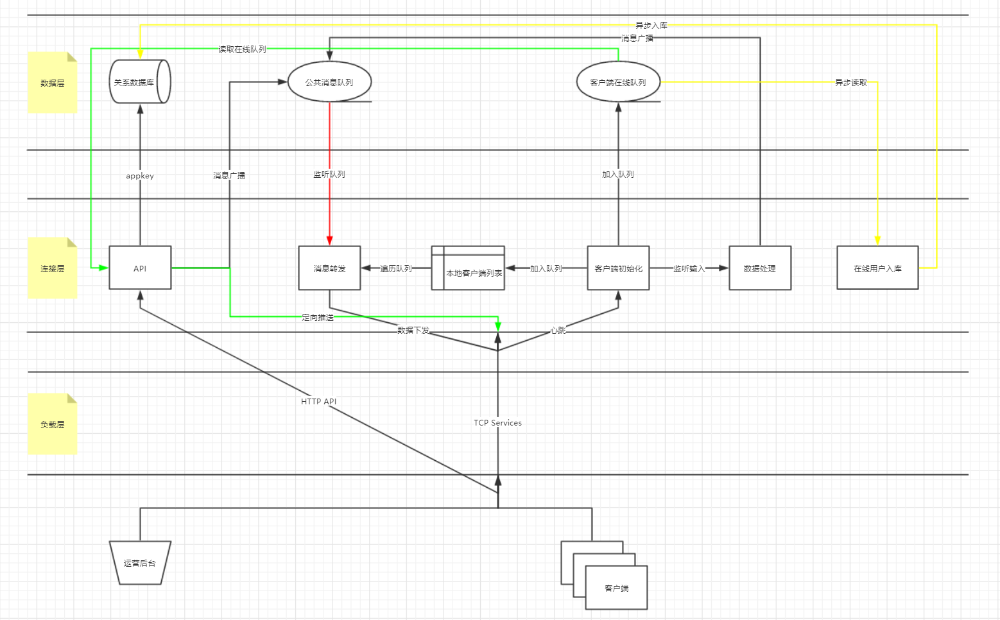

# GIM
<div >
  <a></a>
  <a href="https://travis-ci.com/wangxiaoqiange/gim">
      
  </a>
  <a href="https://github.com/wangxiaoqiange/gim/blob/master/LICENSE">
      
  </a>
</div>

---

🎉🎉🎉一款高性能的即时通讯系统，它使用 Go（golang） 开发完成。🎉🎉🎉

## 核心逻辑



## 功能列表

- 聊天室

    > 一个比较自由的空间，用户可以随意加入、退出聊天室。 典型应用场景如：公开课、网络直播。

- ~~用户资料托管~~

    > ~~服务端存储用户资料如：姓名、性别、年龄、城市、联系方式等。可用于消息的定向推送等。~~

- 消息推送服务

    > 向选定用户群推送消息，使命必达。

## 快速开始

### 克隆仓库

```bash
shell > git clone https://github.com/wangxiaoqiange/gim.git
```

### 编辑配置文件

> src/config.json, 主要修改 Redis 即可

### 启动服务端

```bash
shell > docker-compose -f docker/server/docker-compose.yml up -d

# 默认监听
# Restful API  -> :8080
# IM Service   -> :8081
# Push Service -> :8082
```

### 启动客户端(Push)

```bash
shell > docker run wangxiaoqiang/gim-client -host x.x.x.x -port 8082 -appkey test -id 000 -name xxx -loop

# -host 指定 GIM Push 服务监听地址, 注意不能写 127.0.0.1
```

### 消息推送

```bash
shell > curl -X POST http://127.0.0.1:8080/services/push \
-H "Content-Type: application/x-www-form-urlencoded" \
-d "appkey=test&mode=push&message=are you ok ?" \
-D -

HTTP/1.1 200 OK
Date: Fri, 26 Jul 2019 03:24:44 GMT
Content-Length: 0

# 消息发送成功, 客户端显示 are you ok ?
```

## TODO

* 接口授权、客户端授权

* 客户端资料存储

* 离线消息

* 压力测试
